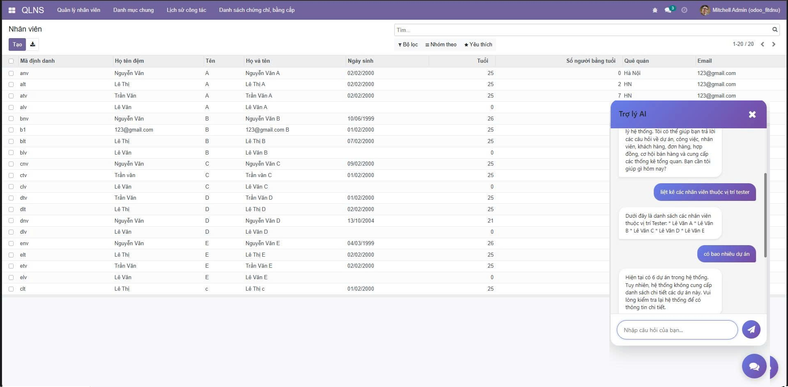
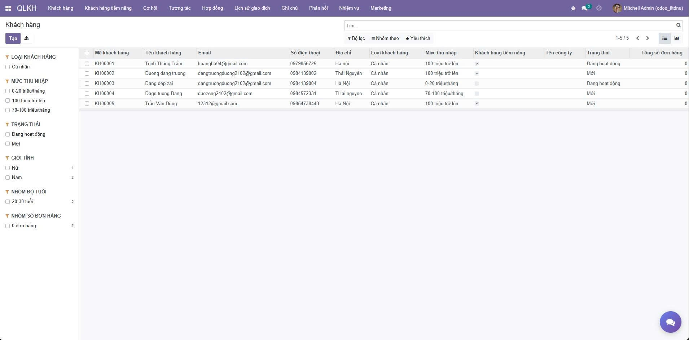

<h2 align="center">
    <a href="https://dainam.edu.vn/vi/khoa-cong-nghe-thong-tin">
    🎓 Faculty of Information Technology (DaiNam University)
    </a>
</h2>
<h2 align="center">
   Hệ thống quản lý khách hàng và công việc trên nền tảng Odoo 15
</h2>
<div align="center">
    <p align="center">
        
        
        
    </p>

[](https://www.facebook.com/DNUAIoTLab)
[](https://dainam.edu.vn/vi/khoa-cong-nghe-thong-tin)
[](https://dainam.edu.vn)
</div>

## 1. Tổng quan về hệ thống

Giải pháp được triển khai dựa trên nền tảng Odoo phiên bản 15, hướng tới việc xây dựng một hệ thống quản lý tổng thể cho doanh nghiệp. Hệ thống tập trung hỗ trợ các hoạt động vận hành quan trọng như quản lý nguồn nhân lực, quản lý quan hệ khách hàng và tổ chức công việc nội bộ. Kiến trúc hệ thống được thiết kế theo hướng phân tách chức năng, cho phép từng thành phần hoạt động độc lập nhưng vẫn kết nối với nhau trong một thể thống nhất.

Thông qua cơ chế liên thông dữ liệu giữa các phân hệ, toàn bộ thông tin phát sinh trong quá trình làm việc được lưu trữ và xử lý tập trung. Điều này giúp doanh nghiệp dễ dàng kiểm soát luồng công việc, hạn chế sự trùng lặp dữ liệu, giảm phụ thuộc vào thao tác thủ công và nâng cao hiệu quả trong công tác quản lý, giám sát và đánh giá hoạt động.

Bên cạnh việc đáp ứng các yêu cầu quản lý cơ bản, hệ thống còn được bổ sung nhiều tiện ích nhằm gia tăng giá trị sử dụng, bao gồm tự động hóa các kịch bản chăm sóc khách hàng, hỗ trợ tiếp nhận và xử lý phản hồi – khiếu nại, tích hợp lịch làm việc với nền tảng Google Calendar, cũng như chatbot nội bộ phục vụ tra cứu nhanh các quy định và chính sách của doanh nghiệp. Những chức năng này giúp hệ thống tiệm cận hơn với môi trường làm việc thực tế và nâng cao mức độ thuận tiện cho người dùng.

# Công nghệ sử dụng


[](https://github.com/PyCQA/bandit)


# 1. Cài đặt công cụ, môi trường và các thư viện cần thiết

## 1.1. Clone project.
git clone https://gitlab.com/anhlta/odoo-fitdnu.git
git checkout 

## 1.2. cài đặt các thư viện cần thiết

Người sử dụng thực thi các lệnh sau đề cài đặt các thư viện cần thiết

```
sudo apt-get install libxml2-dev libxslt-dev libldap2-dev libsasl2-dev libssl-dev python3.10-distutils python3.10-dev build-essential libssl-dev libffi-dev zlib1g-dev python3.10-venv libpq-dev
```
## 1.3. khởi tạo môi trường ảo.

`python3.10 -m venv ./venv`
Thay đổi trình thông dịch sang môi trường ảo và chạy requirements.txt để cài đặt tiếp các thư viện được yêu cầu

```
source venv/bin/activate
pip3 install -r requirements.txt
```

# 2. Setup database

Khởi tạo database trên docker bằng việc thực thi file dockercompose.yml.

`docker-compose up -d`

# 3. Setup tham số chạy cho hệ thống

## 3.1. Khởi tạo odoo.conf

Tạo tệp **odoo.conf** có nội dung như sau:

```
[options]
addons_path = addons
db_host = localhost
db_password = odoo
db_user = odoo
db_port = 5432
xmlrpc_port = 8069
```
Có thể kế thừa từ **odoo.conf.template**

Ngoài ra có thể thêm mổ số parameters như:

```
-c _<đường dẫn đến tệp odoo.conf>_
-u _<tên addons>_ giúp cập nhật addons đó trước khi khởi chạy
-d _<tên database>_ giúp chỉ rõ tên database được sử dụng
--dev=all giúp bật chế độ nhà phát triển 
```

# 4. Chạy hệ thống và cài đặt các ứng dụng cần thiết

Người sử dụng truy cập theo đường dẫn _http://localhost:8069/_ để đăng nhập vào hệ thống.

Hoàn tất
# 5. Modul Nhân sự, Quản lý công việc, Quản lý khách hàng
# Các Module Tùy Chỉnh cho Odoo

Dự án này bao gồm 3 module tùy chỉnh được phát triển cho công ty FITDNU, giúp quản lý nhân sự, khách hàng và công việc một cách hiệu quả.

## 1. Module Nhân Sự (nhan_su)

### Giới thiệu
Module này là nền tảng để quản lý thông tin nhân viên và chức vụ. Các module khác như quản lý công việc và khách hàng sẽ sử dụng dữ liệu từ đây.

### Tính năng chính
- **Quản lý nhân viên**: Lưu thông tin cá nhân, liên hệ, chức vụ.
- **Quản lý chức vụ**: Danh sách các vị trí trong công ty.
- **Lịch sử công tác**: Theo dõi quá trình làm việc của nhân viên.
- **Chứng chỉ và bằng cấp**: Quản lý các chứng chỉ của nhân viên.

### Cách cài đặt
Cài module này trước khi cài các module khác như `quan_ly_cong_viec` và `quan_ly_khach_hang`.

### Lưu ý
- Chuẩn hóa danh sách chức vụ để gợi ý nhân viên chính xác.
- Thông tin nhân viên sẽ được sử dụng trong các module khác.

## 2. Module Quản Lý Khách Hàng (quan_ly_khach_hang)

### Giới thiệu
Module này giúp quản lý thông tin khách hàng, theo dõi giao dịch, hợp đồng, và tương tác với khách hàng. Phù hợp cho doanh nghiệp muốn theo dõi khách hàng tiềm năng và chăm sóc khách hàng tốt hơn.\


### Tính năng chính
- **Quản lý khách hàng**: Lưu thông tin cá nhân, công ty, thu nhập, trạng thái.
- **Giao dịch và hợp đồng**: Theo dõi đơn hàng, hợp đồng, cơ hội bán hàng.
- **Tương tác**: Ghi lại các lần liên hệ với khách hàng.
- **Phản hồi và ghi chú**: Thu thập feedback và ghi chú về khách hàng.
- **Chiến dịch marketing**: Quản lý các chiến dịch để thu hút khách hàng.

### Cách cài đặt
1. Cài module `nhan_su` trước.
2. Cài module này.
3. Có thể cài thêm `quan_ly_cong_viec` để liên kết với dự án.

### Lưu ý
- Email và số điện thoại phải đúng định dạng.
- Ngày sinh không được là ngày tương lai.
- Nếu là khách hàng doanh nghiệp, cần nhập tên công ty và mã số thuế.

## 3. Module Quản Lý Công Việc (quan_ly_cong_viec)

### Giới thiệu
Module này giúp quản lý dự án và công việc trong công ty. Bạn có thể tạo dự án, phân chia công việc, theo dõi tiến độ và giao tiếp qua chatbot.


### Tính năng chính
- **Quản lý dự án**: Tạo dự án, chọn khách hàng, người phụ trách, nhân viên tham gia. Theo dõi tiến độ và deadline.
- **Công việc**: Chia công việc thành giai đoạn, gán cho nhân viên, ghi nhật ký làm việc.
- **Đánh giá nhân viên**: Đánh giá hiệu suất của nhân viên trong dự án.
- **Dashboard**: Xem tổng quan số dự án, công việc, tiến độ.
- **Chatbot**: Hỏi nhanh về dự án, công việc qua chatbot tích hợp Gemini.

### Cách cài đặt
1. Cài module `nhan_su` trước.
2. Cài module `quan_ly_khach_hang`.
3. Cài module này.
4. Cấu hình chatbot nếu muốn dùng.

### Lưu ý
- Tiến độ phải từ 0% đến 100%.
- Khi dự án hoàn thành, công việc sẽ tự động chuyển sang giai đoạn hoàn thành.

## Thứ Tự Cài Đặt Các Module
Để tránh lỗi phụ thuộc, hãy cài theo thứ tự sau:
1. `nhan_su`
2. `quan_ly_khach_hang`
3. `quan_ly_cong_viec`

## Tác Giả
Nhóm 7: CNTT16-01
Các module được phát triển cho công ty FITDNU.
    
